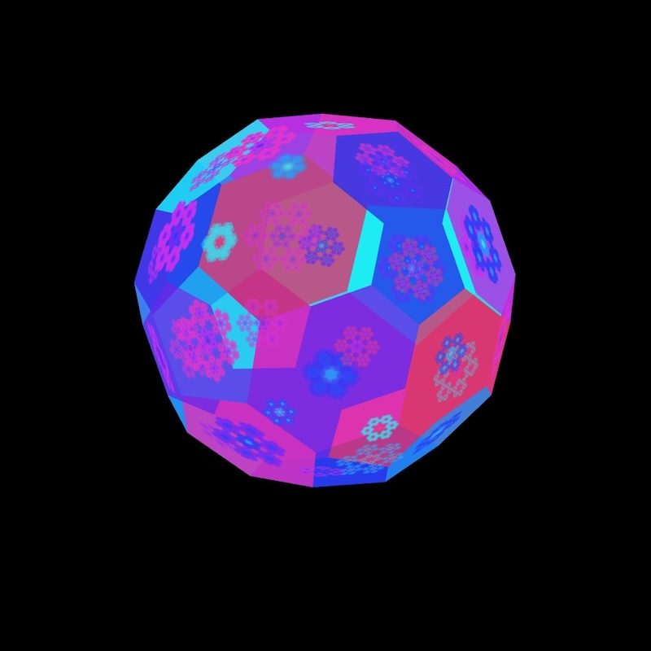

# Buckyball in p5.js

A buckyball (aka truncated icosahedron) is a shape with 60 vertices, 12 pentagonal, and 20 hexagonal faces. I adapted Daniel Shiffman's [code](https://editor.p5js.org/codingtrain/sketches/frIcGeI8l) for rendering a dodecahedron to render the buckyball. If you want to learn more about the buckyball and its relation to the golden ratio, I recommend checking out [The Golden Number](https://www.goldennumber.net/bucky-balls/).

You can check out the code [here](https://editor.p5js.org/kfahn/full/KlWlmtOU9). I also have a version with sprites rendered on each face [here](https://editor.p5js.org/kfahn/full/wpMPtzq2y).

## References

- [Bucky-ball](https://www.goldennumber.net/bucky-balls/)
- [Mathematics and the Buckyball](https://mathweb.ucsd.edu/~fan/amer.pdf)
- [Build a Buckyball Model](https://gems.education.purdue.edu/wp-content/uploads/2019/01/buckyballbuilding.pdf)
- [The Bucky Ball](http://www.ece.northwestern.edu/local-apps/matlabhelp/techdoc/math_anal/sparse12.html)
- [Graphs and Matrices](https://www.mathworks.com/help/matlab/math/graphs-and-matrices.html)
- [Adjacency-matrix-for-soccer-ball-football](https://math.stackexchange.com/questions/4477058/adjacency-matrix-for-soccer-ball-football)
- [Graph 1389 - Truncated Icosahedral Graph](https://houseofgraphs.org/graphs/1389)
- [Truncated_icosahedron](https://en.m.wikipedia.org/wiki/Truncated_icosahedron)
