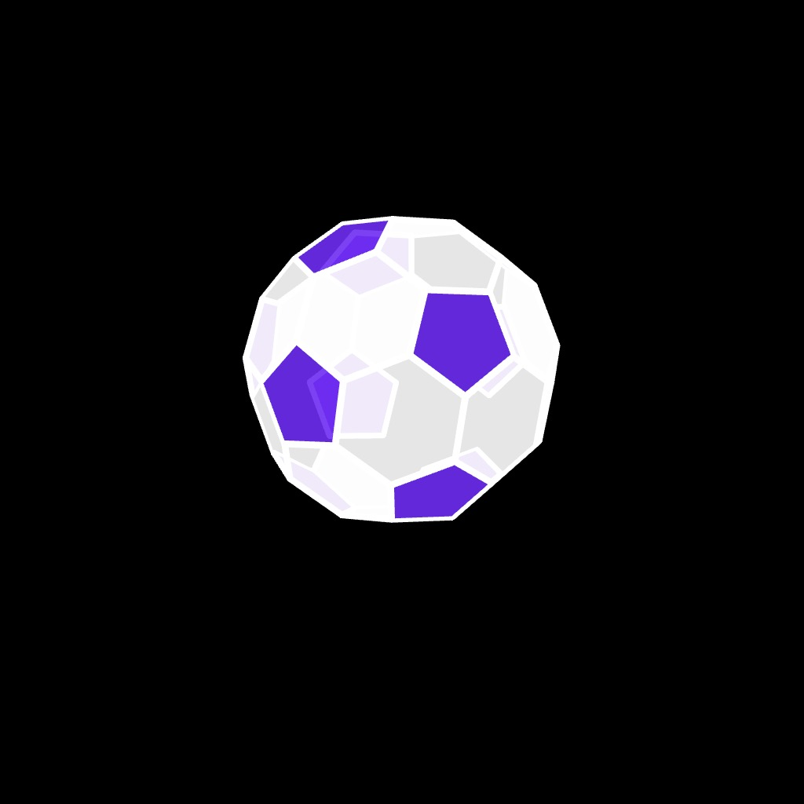
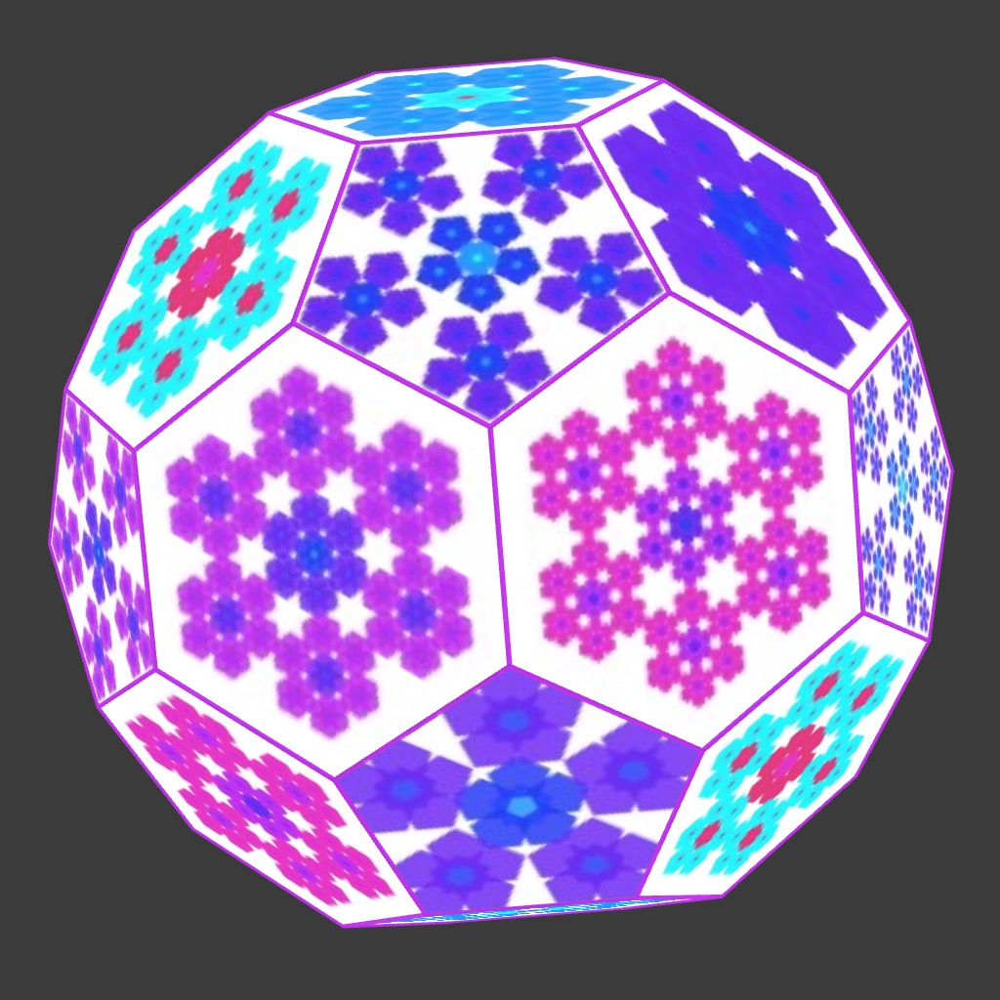

# Buckyball in p5.js

A buckyball (aka truncated icosahedron) is a shape with 60 vertices, 12 pentagonal, and 20 hexagonal faces. I adapted Daniel Shiffman's [code](https://editor.p5js.org/codingtrain/sketches/frIcGeI8l) for rendering a dodecahedron to render the buckyball. I found the vertices for the buckyball at [The Golden Number](https://www.goldennumber.net/bucky-balls/), which is a great place to learn more about the buckyball and its relation to the golden ratio. I tried to find the faces/adjacency matrices online, but the ones I found didn't seem to match up with the vertices. Eventually, I just plotted the vertices with their index numbers and figured the faces myself. It was fairly straight forward adapting Daniel's code with the vertices and faces in hand. You can check out the code [here](https://editor.p5js.org/kfahn/full/KlWlmtOU9).

<p align="center"></p>

The plain vanilla buckyball is pretty cool, but can we take it up a notch? It is not too hard to add color to the faces, creating a "soccer ball", albeit a flat one. You can check out the code [here](https://editor.p5js.org/kfahn/full/0mBhYA8TJ).

<p align="center"></p>

Can we also add a texture on the faces of the buckyball? I started out with a simpler problem, rendering patterns on a cube from a stritesheet I generated using this [code](https://editor.p5js.org/kfahn/sketches/Mv6hd4wbo). Although p5.js has a box() function, the same sprite renders on all of the faces. We can render a unique sprite on each face by building a custom cube using the the plane() function. Suppose you had a white cube and you wanted to add stickers to each of the faces. You would rotate the cube and then center the sticker on the side of the cube facing you. This is what the following code block does.

```JavaScript
push();
texture(faces[0]);
translate(0, 0, size / 2); // Move to center of front face
rotateY(angle); // Rotate the plane
plane(size, size); // Draw a plane for the texture
pop();
```

We will use the same code block for each of the faces of the cube. For the front face, no rotation is necessary so `angle = 0`. For the back face of the cube, we need to rotate around the Y axis by `angle = PI`, for the right face we rotate around the Y axis by `angle = PI/2`, etc. You can learn more about adding textures by watching Daniel Shiffman's [WebGl track](https://thecodingtrain.com/tracks/webgl/webgl/6-createGraphics).

<p align="center"></p>

Rendering sprites on each cube face is relatively straight forward because there is a limited number of faces and the planes intersect perpendicularly. Adding sprites to a dodecahedron is more complicated, and adding them to the buckyball is even more challenging!

Let's start with the dodecahedron. It is not as practical to list of all of the faces. There are too many and they intersect at different angles. We need a different approach -- we are going to calculate the uv coordinates for each vertex.

```Javascript
 vertex(v.x, v.y, v.z, uv.x, uv.y);
```

We can find the bounding box for each face by finding the minium and maximum values for each face. I believe this is the same approach used by the p5.Geometry.calculateBoundingBox() function in [p5.js](https://p5js.org/reference/p5.Geometry/calculateBoundingBox/).

 As a side note, I tried using the built-in p5.Geometry functions to render the dodecahedron and buckyball, but had no luck. Specifically, the getFaces() function did not generate the faces properly.

```JavaScript
findBoundingBox(face) {
    let minX = Infinity,
      maxX = -Infinity,
      minY = Infinity,
      maxY = -Infinity,
      minZ = Infinity,
      maxZ = -Infinity;
    for (let j = 0; j < face.length; j++) {
      let vertex = this.vert[face[j]];
      minX = min(minX, vertex.x);
      maxX = max(maxX, vertex.x);
      minY = min(minY, vertex.y);
      maxY = max(maxY, vertex.y);
      minZ = min(minZ, vertex.z);
      maxZ = max(maxZ, vertex.z);
    }
    return [minX, maxX, minY, maxY, minZ, maxZ];
  }
```

We then pass the vertex and bounding box to the `getUV()` function.

```JavaScript
getUV(v, bounds) {
    let [minX, maxX, minY, maxY] = bounds;

    let uCoord, vCoord;
    uCoord = map(v.x, minX, maxX, 0, 1);
    vCoord = map(v.y, minY, maxY, 0, 1);
    return createVector(uCoord, vCoord);
  }
```

We are able to see the sprites on most of the faces, but on some faces there are stripes instead of the sprites.

<p align="center"></p>

I decided to try changing the coordinate system to (x, z) for these faces and this fixed the issue. You can find the sketch [here](https://editor.p5js.org/kfahn/full/TF2TfVCj1). I will add that a circular sprite would probablly work better as the angle of rotation of each sprite is not properly adjusted for the rotation of each pentagon.

```JavaScript
 let xz = [2, 6, 7, 9, 11];
        if (xz.includes(i)) {
          let newV = createVector(v.x, v.z);
          let bounds = [minX, maxX, minZ, maxZ];
          uv = this.getUV(newV, bounds);
        } else {
          let newV = createVector(v.x, v.y);
          let bounds = [minX, maxX, minY, maxY];
          uv = this.getUV(newV, bounds);
        }
```

<p align="center"></p>

## Buckyball

We can use the same procedure with the buckyball, although there is a complication --
the texture on some of the faces is skewed. I was able to fix several of the faces using ridiculously complex averages, but it doesn't work for all of the faces and is really not a good fix. There is also the issue of the sprites not being rotated properly, so this remains a work in progress. If you would like to check out the sketch, you can find it [here](https://editor.p5js.org/kfahn/sketches/nJ_OdFnxA).

<p align="center"></p>

## Next steps: using the unfolded buckyball to create a uv map

Another possible approach is to try to use the unfolded version of the buckyball to create a uv-mapping.

<p align="center"></p>

## References

- [Bucky-ball](https://www.goldennumber.net/bucky-balls/)
- [Mathematics and the Buckyball](https://mathweb.ucsd.edu/~fan/amer.pdf)
- [Build a Buckyball Model](https://gems.education.purdue.edu/wp-content/uploads/2019/01/buckyballbuilding.pdf)
- [The Bucky Ball](http://www.ece.northwestern.edu/local-apps/matlabhelp/techdoc/math_anal/sparse12.html)
- [Graphs and Matrices](https://www.mathworks.com/help/matlab/math/graphs-and-matrices.html)
- [Adjacency-matrix-for-soccer-ball-football](https://math.stackexchange.com/questions/4477058/adjacency-matrix-for-soccer-ball-football)
- [Graph 1389 - Truncated Icosahedral Graph](https://houseofgraphs.org/graphs/1389)
- [Truncated_icosahedron](https://en.m.wikipedia.org/wiki/Truncated_icosahedron) -[3d-mapping-a-dodecahedron](https://forum.electromage.com/t/3d-mapping-a-dodecahedron/682/3)

Texture

[Calculating uv's](https://discourse.threejs.org/t/help-to-calculate-uvs-for-polygon/31109/4)
[](https://stackoverflow.com/questions/15552521/how-to-determine-uv-texture-coordinates-for-n-sided-polygon)
